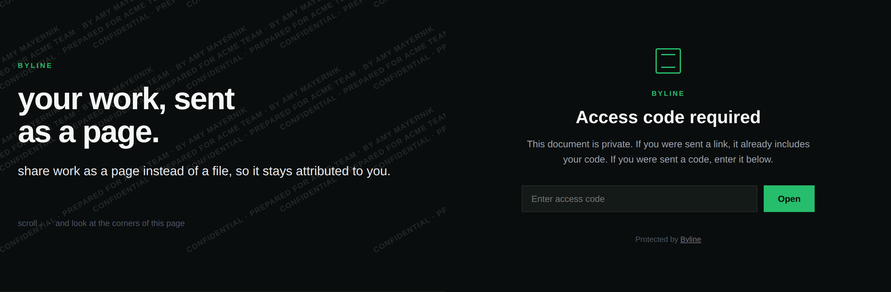

# Byline

**Share your work as a page instead of a file, so it stays attributed to you.**



When you send a PDF, you're sending a copy. It gets forwarded, saved, and reused, and you have no way of knowing where it went. For most things that's fine. It's less fine for the work you do before anyone has signed anything: take-homes, proposals, strategy decks, spec work.

I wanted something in between "locked down" and "here, keep it." Everything I found needed a database and an account. So I built this.

You send a link instead of an attachment. The reader opens it with no login and no password. The name of whoever you sent it to is printed across the page, and yours underneath. You get an email when it's opened. It runs on Vercel, as static files plus one piece of edge middleware, which is code that runs on the server before the page is sent. No terminal is needed to set it up: **[docs/SETUP.md](docs/SETUP.md)** is the click-by-click guide.

Three decisions shape everything else. **No database:** I run no service holding your documents or your readers' behaviour. **Open by default, gated by exception:** a password is friction with the person deciding whether to hire you, so the lock is opt-in. **Email instead of a dashboard:** a dashboard is a place you have to remember to visit, and an inbox is where your tools already live.

What does exist: a short-lived cookie on the reader's browser so you aren't emailed twice, the notification in your inbox with their name and browser in it, and Vercel's own request logs, which record the address and IP for as long as Vercel keeps them. "No database" is an architecture choice, not a claim that nothing about your reader exists anywhere.

---

## Setup

Everything here protects the **deployed site**, not the **repository** the file sits in. A public repo means the document is downloadable from `raw.githubusercontent.com` with no key, no stamp and no notification. Deploy, make the repo private, then add the document. Never the other way round.

[](https://vercel.com/new/clone?repository-url=https://github.com/LFGAmy/byline)

**Without a terminal:** [docs/SETUP.md](docs/SETUP.md) walks through deploy, make it private, upload a PDF, put your name on it, send. It also answers what it costs, what to do when the page is blank, and the other questions people actually ask.

**With one:**

```bash
git clone https://github.com/LFGAmy/byline
cd byline
npm test
vercel
```

Replace `index.html` or add `document.pdf`, set the variables in the Vercel dashboard, then `vercel --prod`.

---

## Two modes

### Open mode, the default

Leave `BYLINE_TOKENS` unset. Anyone with the link reads it. No code, no login, nothing for a recruiter to have to ask you for.

```
https://yourdomain.com/viewer?for=Acme%20Team      (PDF)
https://yourdomain.com/?for=Acme%20Team            (HTML)
```

Every view is stamped `CONFIDENTIAL · PREPARED FOR ACME TEAM · BY YOUR NAME`, tiled diagonally in light grey. Legible in a screenshot without making the document hard to read.

**The reader can take their own name off it.** The name comes from `?for=` in the address, and open mode has no key to check it against, so anyone can delete or change that part before screenshotting, and a forwarded link with `?for=` removed carries no stamp at all. Your own name is the exception: with `BYLINE_OWNER` set, `?by=` is rewritten from config, so a forwarded link can't attribute the work to someone else. Open mode attributes honest copies and deters casual forwarding. It does not survive a motivated recipient. That's the trade for zero friction.

### Gated mode, when it's genuinely confidential

Set `BYLINE_TOKENS` and the document is never served without a valid key.

```
https://yourdomain.com/?key=3f9c2b7e1d4a8f60b2c5e7d9a1f3b4c6
```

Here the name is not taken from the address. It's looked up from the key and rewritten on every request, so deleting `?for=` just redirects you back with it restored, and you can't put someone else's name on it. On first load the key is swapped for an `HttpOnly` cookie and removed from the address bar. The cookie is checked against the current `BYLINE_TOKENS` on every request, which is what makes revocation work.

**Add someone:** append another `key:Name` pair and redeploy.
**Remove someone:** delete their pair and redeploy. About a minute later their link stops working, including for anyone they forwarded it to.
**Give everyone their own key.** One shared key tells you a leak happened. Individual keys tell you whose key it came from.

---

## Settings

Vercel project, **Settings**, **Environment Variables**. None are required. With all of them unset, the document is open to anyone with the link, stamped with the recipient's name only, and nobody is notified. Settings only take effect after a redeploy.

| variable | example | what it does |
|---|---|---|
| `BYLINE_OWNER` | `Jane Smith` | your name under every stamp. Without it the stamp says who it's for but not who made it |
| `BYLINE_NOTIFY` | `you@yourdomain.com` or `https://hooks.slack.com/...` | where to tell you it was opened. An email address or a Slack/Discord webhook URL; it works out which |
| `BYLINE_RESEND_KEY` | `re_xxxxxxxx` | free [Resend](https://resend.com) key. Only needed if you put an email address above |
| `BYLINE_RECIPIENTS` | `Acme Team,Beta Co` | optional. Only these names can trigger a notification. Stops name spoofing; it is not a rate limit |
| `BYLINE_TOKENS` | `3f9c2b7e1d4a8f60b2c5e7d9a1f3b4c6:Acme Team` | comma-separated `key:Recipient Name` pairs. Setting this turns on gated mode |
| `BYLINE_SECRET` | any long random string | optional. Signs the "already notified" cookie. If unset, your Resend key or webhook URL is used |

**Generate keys, don't invent them.** There is no limit on guesses, so a short key is a weak lock. `openssl rand -hex 16`, or a password manager's generator set to 32 letters and digits.

If `BYLINE_TOKENS` is set but nothing valid parses out of it, say a space where a colon should be, the site shows a generic "not available" page and writes the reason to your Vercel logs. It does not quietly fall back to open mode. A broken lock should read as locked.

---

## Getting told when it's opened

**Nothing.** Leave `BYLINE_NOTIFY` unset. Everything else works.

**Slack or Discord.** Paste an incoming webhook URL. No email service, no extra account.

**Email.** Your address in `BYLINE_NOTIFY`, a free [Resend](https://resend.com) key in `BYLINE_RESEND_KEY`. The free plan covers 3,000 emails a month. It sends from `onboarding@resend.dev`, a shared address Resend provides so new accounts work immediately, so there are no DNS records to add. Because it's a shared sender, open your own link once and check your spam folder; if it landed there, mark it not spam.

> **Subject:** Byline: Acme Team opened your document
>
> Acme Team opened your document.
> When: Wed, 17 Sep 2026 18:04:00 GMT
> Client: Chrome, macOS

You learn that it was opened, by which link, and roughly what in.

**What counts as opened.** The page reports in after it has drawn the stamp, and that report is what sends the email, not the fetch of the URL. That distinction matters for your audience: corporate email scanners, Teams and WhatsApp link previews all fetch links with a browser's user agent, and none of them run the page. Counting fetches would tell you "Acme Team opened your document" the moment their mail server saw the link. Counting the report tells you a person's browser rendered it. The cost is that a reader with JavaScript disabled is never reported, which is the right side to be wrong on.

**How often:** one email per recipient per browser per day. The reader's browser gets a cookie holding a tag for each name it has already reported. The tag is an HMAC over the recipient and the UTC date, signed with a secret the reader doesn't have, so a cookie kept from yesterday doesn't work today. A different device, or cleared cookies, notifies again. In open mode none of this protects much, since the reader can drop `?for=` and not be reported at all; the signing earns its keep in gated mode, where the name comes from the key.

Every notification carries the same block, same keys, same order, so an agent with access to your inbox can match on the `Byline:` subject prefix and draft the follow-up or log the open, with no API to integrate:

```
--- byline ---
event: document_opened
recipient: Acme Team
document: /viewer
client: Chrome, macOS
at: 2026-09-17T18:04:00.000Z
--- end ---
```

In open mode the `recipient` field is typed by whoever holds the link. It's sanitized and capped at 40 characters, which still fits a short imperative sentence, so an agent should treat it as text from a stranger, not as an instruction.

---

## How the protection works

**The stamp.** Every view carries the recipient's name. In gated mode that name comes from the key and can't be swapped. For PDFs it's drawn into the canvas pixels as well as laid over the page, so it's in the image itself, not only on top of it.

**The token gate.** With `BYLINE_TOKENS` set, no valid key means the document is never sent. Not hidden behind a dialog, not blurred with CSS. Never sent, so there's nothing in the page to inspect.

**Crawler blocking.** Known AI and SEO crawlers get a 403: GPTBot, ClaudeBot, CCBot, PerplexityBot, Bytespider, Amazonbot and friends, plus `curl`, `wget`, `python-requests` and `scrapy`. `robots.txt` names the training crawlers and is served to them above that block, or it would be decoration. `Google-Extended` and `Applebot-Extended` are in `robots.txt` and deliberately not in the user-agent list: they're robots.txt control tokens, nothing ever sends them as a user agent, so blocking them there would be theatre.

**Headers.** `noindex` everywhere, a strict Content-Security-Policy with no inline script allowance, which is why every script is its own file, `frame-ancestors 'none'`, `no-referrer`, `no-store`, and `Cross-Origin-Resource-Policy: same-origin`.

**Nothing third-party loads.** The PDF renderer is vendored, there's no font service and no analytics. Every request a reader's browser makes goes to your deployment.

---

## The PDF renderer

[pdf.js](https://github.com/mozilla/pdf.js) 6.3.289 lives in `vendor/` rather than loading from a CDN: nothing third-party executes on a page displaying a confidential document, it works behind corporate networks that block CDNs, and there's no integrity hash to rotate. It's the `legacy/` build, because the current `build/` output calls `Map.prototype.getOrInsertComputed`, a JavaScript method new enough that Chromium 141, current when this was written, doesn't have it, and that build renders a blank page. You find that out by testing in a browser rather than by reading the docs, which is the only reason it's written down here.

`?doc=` accepts only same-origin relative `.pdf` paths, because a viewer that loads any address you hand it will run someone else's file in your page, and a malicious PDF can execute script.

To update, pin the version:

```bash
npm pack pdfjs-dist@6.3.289 --pack-destination /tmp
tar -xzf /tmp/pdfjs-dist-6.3.289.tgz -C /tmp
cp /tmp/package/legacy/build/pdf.min.mjs /tmp/package/legacy/build/pdf.worker.min.mjs vendor/
```

---

## Limitations

The edges, including the ones I can't close.

- **The repository is not the site.** Public repo, public document, whatever mode you're in.
- **The raw file is one request away.** Navigating to `/document.pdf` in a browser gets bounced to the viewer, but that check reads `Sec-Fetch-Dest`, a header only browsers send, and Safari before 16.4 doesn't send it. A script that omits it, or "save link as", gets the original bytes unstamped. In gated mode they need a valid key first; in open mode they need the link. **If the file itself must never leave clean, this is not the tool.** That needs server-side PDF rewriting and a real backend.
- **Screenshots work, and always will.** Any tool claiming otherwise is misleading you. The stamp is the answer, not prevention. For an HTML document, select-all and copy also yields clean text, because the overlay isn't part of the page content.
- **Open mode's stamp can be removed by the reader,** because it comes from the address bar. In gated mode the name can't be changed, but a reader with a valid key can still fetch the raw file, so "cannot be removed" is only true of the page as served.
- **Crawler blocking only stops crawlers that tell the truth.** Anything willing to lie about its user agent walks past it. In gated mode the token gate catches it; in open mode nothing does. Tidiness, not defence. A side effect: the match includes the bare word `bot`, so Slack, Discord and LinkedIn link previews are refused too, and your link shows no preview card when pasted.
- **No rate limit on anything.** Key guesses are unlimited, so use generated keys. In open mode anyone with the link can post the "opened" report, and neither the daily cookie nor the allowlist stops a script from doing it fifty times, which on Resend's free tier means your notifications go quiet for the day. If that matters, use gated mode.
- **Filenames are guessable in open mode.** Host two documents and switch with `?doc=` and anyone holding one link can try the other name. Use one deployment per document, or gated mode.
- **No expiry, and updates are silent.** A link works until you remove the document or the key. Committing a new file replaces the old one under the same address, so you can't tell which version a given recipient saw.
- **This is not DRM or encryption.** It's access control plus attribution, which is a smaller claim and an achievable one.
- **No page-level analytics, on purpose.** [DocSend](https://docsend.com) and [Papermark](https://github.com/mfts/papermark) will tell you how long someone spent on slide seven. That means a database holding other people's reading behaviour, and that's a different product with a privacy policy attached. If that's what you need, use them. They're good.

---

## Files

| file | what it is |
|---|---|
| `middleware.js` | the gate. crawler blocking, token check, stamp parameter, and the `/opened` report that sends notifications. Built by `createMiddleware(env, deps)` so tests can walk a real `Request` through it. Vercel's `next()` is three lines, reproduced here rather than imported |
| `lib.js` | the pure logic: token parsing, sanitizing, signed seen-tags. Imported by both the middleware and the browser |
| `watermark.js` | the stamp, and the "opened" report it sends once drawn. One implementation shared by both pages, built with `createElement`, never `innerHTML`. Picks light or dark ink from the page's own background |
| `viewer.js` | PDF rendering, and burning the stamp into each canvas |
| `index.html` | your document, if it's HTML. Replace this one |
| `viewer.html` | the PDF viewer page |
| `gate.html`, `gate.js` | what someone without a key sees |
| `vendor/` | pdf.js, vendored so nothing third-party loads at runtime |
| `vercel.json` | headers and `cleanUrls` |
| `robots.txt` | disallow everything, AI crawlers named explicitly |
| `tests/` | the suite, covering the pure logic and every request path through the middleware. Runs on every push in GitHub Actions; `npm test` needs nothing installed |

---

About 500 lines of JavaScript, no runtime dependencies, and some configuration.

Built by [Amy Mayernik](https://lfgamy.com). MIT licensed.
